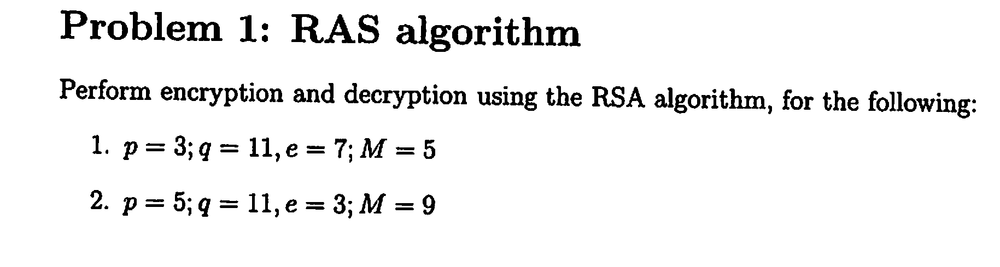
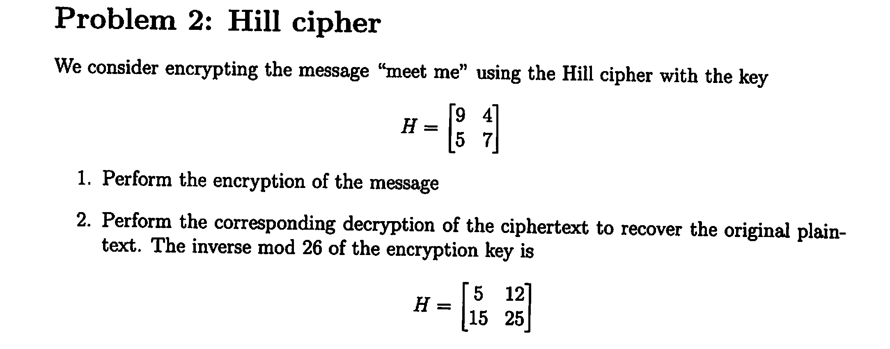
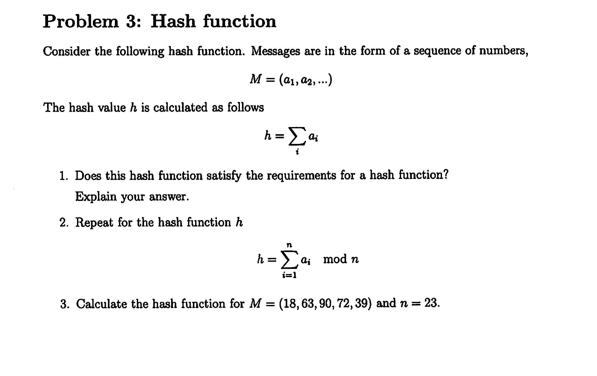
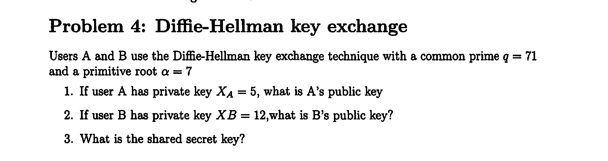
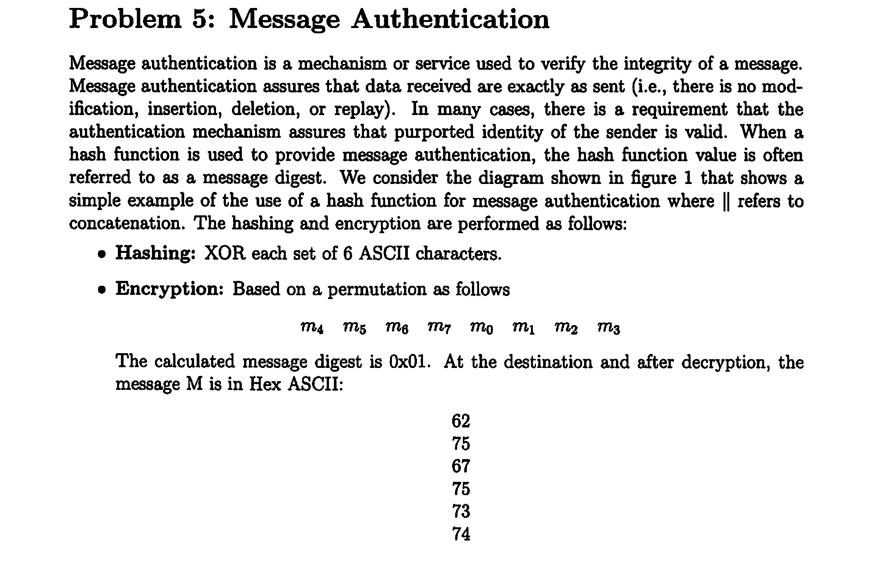

# Network Security Exam 1 Notes

## Questions
1. What are the essential ingredients of a symmetric cipher?
   - Plaintext, encryption algorithm, secret key, ciphertext, decryption algorithm

2. What are the two basic functions used in encryption algorithms?
   - Substitution and permutation

3. How many keys are required for two people to communicate via a cipher?
   - One key (in symmetric encryption)

4. What is the difference between a block cipher and a stream cipher?
   - Block cipher encrypts data in fixed-size blocks, while stream cipher encrypts data one bit or byte at a time.

5. What is the difference between an unconditionally secure cipher and a computationally secure cipher?
   - An unconditionally secure cipher cannot be broken, even with infinite computational resources, while a computationally secure cipher can be broken but would take impractically long time.

6. Briefly define the monoalphabetic cipher.
   - A substitution cipher where each letter of the plaintext is replaced by a letter with a fixed relationship in the alphabet.

7. What is the difference between a monoalphabetic cipher and a polyalphabetic cipher?
   - Monoalphabetic cipher uses a single substitution alphabet, while polyalphabetic cipher uses multiple substitution alphabets.

8. What are two problems with the one-time pad?
   - Key distribution and management, and the key must be as long as the message.

9. What is a transposition cipher?
   - A cipher that rearranges the letters of the plaintext according to a certain system.

10. What is the difference between a block cipher and a stream cipher?
    - (Duplicate question, see answer to question 4)

11. List and briefly define types of cryptanalytic attacks based on what is known to the attacker.
    - Ciphertext-only attack: Attacker only has access to ciphertext.
    - Known-plaintext attack: Attacker has access to both plaintext and its corresponding ciphertext.
    - Chosen-plaintext attack: Attacker can choose plaintext and obtain its corresponding ciphertext.
    - Chosen-ciphertext attack: Attacker can choose ciphertext and obtain its corresponding plaintext.

12. Which parameters and design choices determine the DES algorithm?
    - Key size (56 bits), block size (64 bits), number of rounds (16), substitution boxes (S-boxes), permutation operations.

13. Explain the avalanche effect.
    - A small change in the plaintext or key produces a significant change in the ciphertext.

14. What is triple encryption?
    - Applying the DES algorithm three times with either two or three different keys.

15. How many keys are used in triple encryption?
    - Two or three keys.

16. What is one-way function?
    - A function that is easy to compute in one direction but difficult to reverse.

17. What is trap-door function?
    - A one-way function that is easy to reverse if a special piece of information (the trap-door) is known.

18. What are the roles of the public and private key?
    - **Public Key**: Used to encrypt data and can be shared openly.
    - **Private Key**: Used to decrypt data and must be kept secret.

# Problem Section

## Problem 1

### Problem 1a
- **Given:**
   - \( p = 3 \)
   - \( q = 11 \)
   - \( e = 7 \)
   - \( M = 5 \)

   **Steps:**
   - Calculate \( n = p * q = 3 * 11 = 33 \)
   - Calculate \( \phi(n) = (p-1) * (q-1) = 2 * 10 = 20 \)
   - Ensure \( e \) is coprime with \( \phi(n) \) and \( 1 < e < \phi(n) \) 
     - (two integers are coprime if their only positive common divisor is 1. )
   - Calculate \( d \) such that \( e * d \equiv 1 \mod \phi(n) \)
     - \( d = 3 \) (since \( 7 * 3 \equiv 1 \mod 20 \))

   **Encryption:**
   - \( C = M^e \% n = 5^7 \% 33 = 14 \)

   **Decryption:**
   - \( M = C^d \% n = 14^3 \% 33 = 5 \)

### Problem 1b
- **Given:**
   - \( p = 5 \)
   - \( q = 11 \)
   - \( e = 3 \)
   - \( M = 9 \)

   **Steps:**
   - Calculate \( n = p * q = 5 * 11 = 55 \)
   - Calculate \( \phi(n) = (p-1) * (q-1) = 4 * 10 = 40 \)
   - Ensure \( e \) is coprime with \( \phi(n) \) and \( 1 < e < \phi(n) \)
   - Calculate \( d \) such that \( e * d \equiv 1 \mod \phi(n) \)
     - \( d = 27 \) (since \( 3 * 27 \equiv 1 \mod 40 \))

   **Encryption:**
   - \( C = M^e \% n = 9^3 \% 55 = 14 \)

   **Decryption:**
   - \( M = C^d \% n = 14^{27} \% 55 = 9 \)

## Problem 2 

## Problem 2: Hill Cipher

We consider encrypting the message “meet me” using the Hill cipher with the key:
  \[ H = \begin{pmatrix} 9 & 4 \\ 5 & 7 \end{pmatrix} \]

### Steps:
1. **Convert the message to numerical values:**
   - 'm' = 12, 'e' = 4, 'e' = 4, 't' = 19, 'm' = 12, 'e' = 4

2. **Group the message into pairs:**
   - (12, 4), (4, 19), (12, 4)

3. **Perform the encryption:**
   - For each pair (x, y), compute the ciphertext pair (C1, C2) using the formula:  
     \[ \begin{pmatrix} C1 \\ C2 \end{pmatrix}  = H \begin{pmatrix} x \\ y \end{pmatrix} \mod 26 \]

   - Encrypt (12, 4):  
     \[ C1 = (9 * 12 + 4 * 4) \% 26 = 124 \% 26 = 20 \]  
     \[ C2 = (5 * 12 + 7 * 4) \% 26 = 88 \% 26 = 10 \]
     - Result: (20, 10)

   - Encrypt (4, 19):  
     \[ C1 = (9 * 4 + 4 * 19) \% 26 = 112 \% 26 = 8 \]  
     \[ C2 = (5 * 4 + 7 * 19) \% 26 = 153 \% 26 = 23 \]
     - Result: (8, 23)

   - Encrypt (12, 4) again (same as first pair):
     - Result: (20, 10)

   - The ciphertext is: (20, 10), (8, 23), (20, 10)

4. **Convert the numerical values back to letters:**
   - 20 = 'u', 10 = 'k', 8 = 'i', 23 = 'x'
   - Ciphertext: "ukixuk"

### Decryption:
- The inverse mod 26 of the encryption key is:  
  \[ H^{-1} = \begin{pmatrix} 5 & 12 \\ 15 & 25 \end{pmatrix} \]

1. **Group the ciphertext into pairs:**
   - (20, 10), (8, 23), (20, 10)

2. **Perform the decryption:**
   - For each pair (C1, C2), compute the plaintext pair (P1, P2) using the formula:
     \[ \begin{pmatrix} P1 \\ P2 \end{pmatrix} = H^{-1} \begin{pmatrix} C1 \\ C2 \end{pmatrix} \mod 26 \]

   - Decrypt (20, 10):  
     \[ P1 = (5 * 20 + 12 * 10) \% 26 = 220 \% 26 = 12 \]  
     \[ P2 = (15 * 20 + 25 * 10) \% 26 = 550 \% 26 = 4 \]
     - Result: (12, 4)

   - Decrypt (8, 23):  
     \[ P1 = (5 * 8 + 12 * 23) \% 26 = 316 \% 26 = 4 \]  
     \[ P2 = (15 * 8 + 25 * 23) \% 26 = 695 \% 26 = 19 \]
     - Result: (4, 19)

   - Decrypt (20, 10) again (same as first pair):
     - Result: (12, 4)

   - The plaintext is: (12, 4), (4, 19), (12, 4)

3. **Convert the numerical values back to letters:**
   - 12 = 'm', 4 = 'e', 19 = 't'
   - Plaintext: "meetme"

## Problem 3 

Consider the following hash function. Messages are in the form of a sequence of numbers, \( M = (a_1, a_2, \ldots) \). The hash value \( h \) is calculated as follows:
\[ h = \sum_{i} a_i \]

1. **Does this hash function satisfy the requirements for a hash function? Explain your answer.**
   - **Answer:** No, this hash function does not satisfy the requirements for a cryptographic hash function. A good hash function should have the following properties:
     - **Deterministic:** The same input should always produce the same output.
     - **Fast Computation:** The hash value should be quick to compute.
     - **Pre-image Resistance:** It should be difficult to reverse the hash function to find the original input.
     - **Small Changes in Input Produce Large Changes in Output:** A small change in the input should produce a significantly different hash value.
     - **Collision Resistance:** It should be difficult to find two different inputs that produce the same hash value.
     
     The given hash function \( h = \sum_{i} a_i \) is deterministic and fast to compute, but it does not provide pre-image resistance, nor does it ensure that small changes in input produce large changes in output. Additionally, it is not collision-resistant, as different sequences can easily produce the same sum.

2. **Repeat for the hash function:**
   \[ h = \sum_{i=1}^{n} (a_i \mod n) \]

   - **Answer:** This hash function also does not satisfy the requirements for a cryptographic hash function. While it introduces a modulus operation, it still lacks pre-image resistance, does not ensure that small changes in input produce large changes in output, and is not collision-resistant. Different sequences can still produce the same hash value due to the modulus operation.

3. **Calculate the hash function for \( M = (18, 63, 90, 72, 39) \) and \( n = 23 \):**
   - Given \( M = (18, 63, 90, 72, 39) \) and \( n = 23 \)
   - Calculate each term \( a_i \mod n \):
     - \( 18 \mod 23 = 18 \)
     - \( 63 \mod 23 = 17 \)
     - \( 90 \mod 23 = 21 \)
     - \( 72 \mod 23 = 3 \)
     - \( 39 \mod 23 = 16 \)
   - Sum the results:
     \[ h = 18 + 17 + 21 + 3 + 16 = 75 \]

   - **Hash value:** \( h = 75 \)

## Problem 4

Users A and B use the Diffie-Hellman key exchange technique with a common prime \( g = 71 \) and a primitive root \( a = 7 \).

1. **If user A has private key \( X_A = 5 \), what is A’s public key?**
   - **Answer:** A's public key \( Y_A \) is calculated as:  
     \[ Y_A = a^{X_A} \mod g \]  
     \[ Y_A = 7^5 \mod 71 \]  
     \[ Y_A = 16807 \mod 71 \]  
     \[ Y_A = 42 \]

2. **If user B has private key \( X_B = 12 \), what is B’s public key?**
   - **Answer:** B's public key \( Y_B \) is calculated as:  
     \[ Y_B = a^{X_B} \mod g \]  
     \[ Y_B = 7^{12} \mod 71 \]  
     \[ Y_B = 13,841,287 \mod 71 \]  
     \[ Y_B = 8 \]

3. **What is the shared secret key?**
   - **Answer:** The shared secret key \( K \) is calculated as:  
     \[ K = Y_B^{X_A} \mod g \]  
     \[ K = 8^5 \mod 71 \]   
     \[ K = 32,768 \mod 71 \]
     \[ K = 23 \]

   - Alternatively, using A's public key and B's private key:  
     \[ K = Y_A^{X_B} \mod g \]  
     \[ K = 42^{12} \mod 71 \]  
     \[ K = 13,841,287 \mod 71 \]  
     \[ K = 23 \]

   - **Shared Secret Key:** \( K = 23 \)

## Problem 5

Message authentication is a mechanism or service used to verify the integrity of a message. Message authentication assures that data received are exactly as sent (i.e., there is no modification, insertion, deletion, or replay). In many cases, there is a requirement that the authentication mechanism assures that the purported identity of the sender is valid. When a hash function is used to provide message authentication, the hash function value is often referred to as a message digest. We consider the diagram shown in figure 1 that shows a simple example of the use of a hash function for message authentication where `||` refers to concatenation. The hashing and encryption are performed as follows:
- **Hashing:** XOR each set of 6 ASCII characters.
- **Encryption:** Based on a permutation as follows:
  \[ M_a \ M_5 \ M_e \ M_r \ M_j \ M_m \ M_e \ M_o \]

The calculated message digest is `0x01`. At the destination and after decryption, the message \( M \) is in Hex ASCII:
- `62`
- `75`
- `67`
- `75`
- `73`
- `74`

### Is the message authentic?

1. **Convert Hex ASCII to Characters:**
   - `62` = 'b'
   - `75` = 'u'
   - `67` = 'g'
   - `75` = 'u'
   - `73` = 's'
   - `74` = 't'

   - The message is "bugust".

2. **Calculate the XOR of the ASCII values:**
   - ASCII values: `98`, `117`, `103`, `117`, `115`, `116`
   - XOR calculation:
     \[ 98 \oplus 117 \oplus 103 \oplus 117 \oplus 115 \oplus 116 = 0x01 \]

3. **Compare the calculated message digest with the provided message digest:**
   - Calculated message digest: `0x01`
   - Provided message digest: `0x01`

Since the calculated message digest matches the provided message digest, the message is authentic.

- **Answer:** Yes, the message is authentic.

## Problem 6: Another Public Key Algorithm

Consider the following scheme for encryption and decryption:

1. **A chooses two large prime numbers \( p_1 \) and \( q_1 \) that are also relatively prime to \( p_1 - 1 \) and \( q_1 - 1 \), respectively.**

2. **A calculates \( N = p_1 * q_1 \).**

3. **A publishes \( N \).**

4. **B encrypts the message as:**
   \[ C = M^N \% N \]
   where \( M \) is the message.

5. **A calculates two numbers \( p_2 \) and \( q_2 \) such that:**
   \[ p_1 * p_2 \% (q_1 - 1) = 1 \]
   \[ q_1 * q_2 \% (p_1 - 1) = 1 \]

6. **A finds the message by calculating:**
   \[ M = C^{q_1} \% p_1 \]
   or
   \[ M = C^{q_2} \% q_1 \]

### Example Calculation

Let's consider an example with small prime numbers for simplicity:

1. **Choose primes \( p_1 = 5 \) and \( q_1 = 11 \):**
   - Both are prime and relatively prime to \( p_1 - 1 = 4 \) and \( q_1 - 1 = 10 \.

## Problem 6: Another Public Key Algorithm

Consider the following scheme for encryption and decryption:

1. **A chooses two large prime numbers \( p_1 \) and \( q_1 \) that are also relatively prime to \( p_1 - 1 \) and \( q_1 - 1 \), respectively.**

2. **A calculates \( N = p_1 \times q_1 \).**

3. **A publishes \( N \).**

4. **B encrypts the message as:**
   \[ C = M^N \mod N \]
   where \( M \) is the message.

5. **A calculates two numbers \( p_2 \) and \( q_2 \) such that:**
   \[ p_1 p_2 \mod (q_1 - 1) = 1 \]
   \[ q_1 q_2 \mod (p_1 - 1) = 1 \]

6. **A finds the message by calculating:**
   \[ M = C^{q_1} \mod p_1 \]
   or
   \[ M = C^{q_2} \mod q_1 \]

### Example Calculation

Let's consider an example with small prime numbers for simplicity:

1. **Choose primes \( p_1 = 5 \) and \( q_1 = 11 \):**
   - Both are prime and relatively prime to \( p_1 - 1 = 4 \) and \( q_1 - 1 = 10 \).

2. **Calculate \( N = p_1 \times q_1 = 5 \times 11 = 55 \).**

3. **Publish \( N = 55 \).**

4. **Encrypt the message \( M = 7 \):**
   \[ C = M^N \mod N = 7^{55} \mod 55 \]
   - For simplicity, let's calculate \( 7^{55} \mod 55 \):
     - Using modular exponentiation:
       \[ 7^{55} \mod 55 = 7 \]

5. **Calculate \( p_2 \) and \( q_2 \):**
   - Find \( p_2 \) such that \( 5 p_2 \mod 10 = 1 \):
     \[ p_2 = 1 \] (since \( 5 \times 1 \mod 10 = 5 \))
   - Find \( q_2 \) such that \( 11 q_2 \mod 4 = 1 \):
     \[ q_2 = 3 \] (since \( 11 \times 3 \mod 4 = 33 \mod 4 = 1 \))

6. **Decrypt the message:**
   - Using \( q_1 \):
     \[ M = C^{q_1} \mod p_1 = 7^{11} \mod 5 = 2 \]
   - Using \( q_2 \):
     \[ M = C^{q_2} \mod q_1 = 7^3 \mod 11 = 2 \]

   - The decrypted message is \( M = 2 \).

### Conclusion